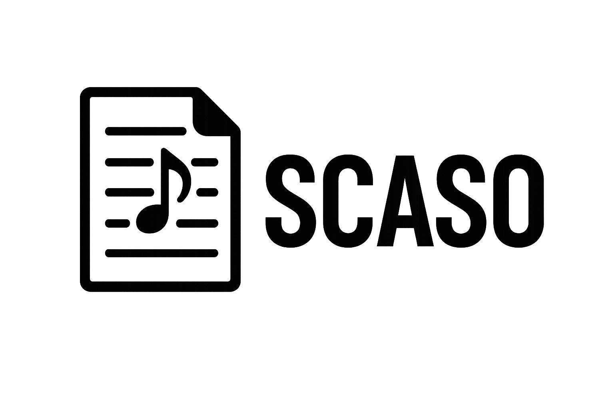
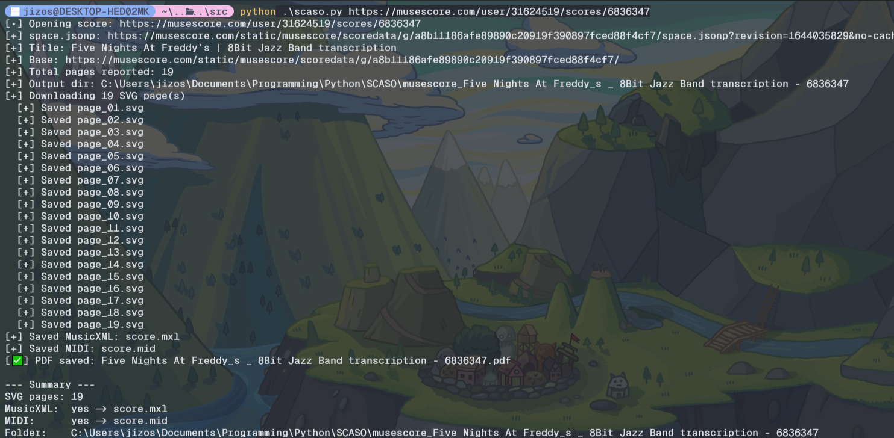

# SCASO Grabber
<p align="center">
  
</p>

<p align="center">
  <a href="https://github.com/yourname/SCASO/blob/main/LICENSE">
    
  </a>
  
  
    
</p>

Fetch MuseScore score assets from the viewer manifest (SVG pages; optional
**MusicXML** and **MIDI**) and (optionally) merge SVGs into a single PDF.

> ⚠️ I DO NOT condone or support the use of this tool for piracy or any other illegal activities. Use responsibly and respect copyright laws.

## 📑 Table of Contents
- [Features](#features)
- [Install Grabber](#-install-grabber)
- [Install Patcher](#-install-patcher)
- [Usage](#usage)
- [Common Examples](#common-examples)
- [Tips](#tips)
- [Legal](#legal)

## ✨ Features
- 🎼 Grabs `svg`, `mxl`, `mid` (pick what you want)
- 📄 Page filtering for SVGs (`--page-range 1-3,5`)
- 📝 Optional SVG→PDF merge (via `cairosvg` + `pypdf`)
- 🕵️ Headless Playwright capture of `space.jsonp`

## 🔮 Install Grabber

### ✅ Requirements:

- Python: 3.9+

- pip (or pipx) and virtualenv

- Playwright browsers (installed below)

- (Optional) Cairo system libs if you want SVG → PDF merge (used by cairosvg)

```bash
# 1) Create & activate a virtualenv
python -m venv .venv

# macOS/Linux:
. .venv/bin/activate

# Windows (PowerShell):
# .\.venv\Scripts\Activate.ps1

# 2) Upgrade base tooling (optional but recommended)
pip install -U pip setuptools wheel

# 3) Install Python deps
pip install -r requirements.txt

# 4) Install Playwright browser binaries
python -m playwright install

# 5) (Optional) If you want SVG->PDF merge, ensure Cairo is present (see OS notes below)

# 6) Sanity check
python scaso.py -h
```

🧪 Verify the Install
```bash
# Help text
python scaso.py -h

# Quick test: fetch only MusicXML/MIDI (no PDF merge)
python scaso.py "<musescore_url>" --no-pdf --formats mxl,mid
```

## 🛠️ Install Patcher

> Use this if you want SCASO to detect Songsterr pages via a local dev extension. No store install needed.

### Chrome / Edge (Chromium)

1) Open *chrome://extensions/* (Edge: edge://extensions/) (Opera opera://extensions/).

2) Toggle *Developer mode* (top right).

3) Click *Load unpacked*.

4) Select the *src/songsterr/* folder.

5) Extension should appear enabled :D

### Firefox (Temporary Add-on)

1) Open *about:debugging#/runtime/this-firefox*.

2) Click *Load Temporary Add-on*.

3) Select *src/songsterr/manifest.json*.

>⚠️ Note: Temporary add-ons disappear on browser restart. Re-load them when you reopen Firefox ⚠️

To verify if the extension is working, visit a Songsterr page and check!

## ⚙️ Usage
```bash
python scaso.py <musescore_url> [options]
```
<details><summary>Full CLI options</summary>

```bash
scaso.py [-h] [-o OUTPUT] [--no-pdf] [--pdf-engine {cairosvg,none}] [--formats FORMATS] [--page-range PAGE_RANGE] [--retries RETRIES] [--throttle THROTTLE] [--headful] url

MuseScore Grabber (SVG pages, optional MusicXML & MIDI) with auto-PDF merge

positional arguments:
  url                   MuseScore score URL

options:
  -h, --help            show this help message and exit
  -o OUTPUT, --output OUTPUT
                        Output directory (default: musescore_<Title - ID>)
  --no-pdf              Disable SVG->PDF merge (default: enabled)
  --pdf-engine {cairosvg,none}
                        PDF engine to use (default: cairosvg)
  --formats FORMATS     Comma separated formats (svg,mxl,mid|midi)
  --page-range PAGE_RANGE
                        Pages to fetch (1-based), e.g. '1-3,5'. Default: all
  --retries RETRIES     HTTP retries per file (default: 2)
  --throttle THROTTLE   ms sleep after each successful GET (default: 75ms)
  --headful             Show the browser (debug) instead of headless
```
</details>

## 📜 Common Examples
```bash
# only MusicXML + MIDI (whole score)
python scaso.py <url> --no-pdf --formats mxl,mid

# only pages 1–3 as SVGs (no pdf merge)
python scaso.py <url> --formats svg --page-range 1-3 --no-pdf

# pages 1–3 + merge into a PDF
python scaso.py <url> --formats svg --page-range 1-3

# everything (SVG + MXL + MID), with page filter for SVGs
python scaso.py <url> --formats svg,mxl,mid --page-range 2-6
```

## ❗ Tips

- Page ranges are 1-based.
- If `space.jsonp` doesn't show up, the score may be private/blocked.
- Use `--headful` to debug Playwright network traffic.
- If playwright fails to launch, ensure you have the necessary browser binaries installed:
  ```bash
  python -m playwright install
  ```
    if still flaky, try running with `--headful` to see the browser UI.
- Some scores may be private/blocked, if we can't fetch `space.jsonp`, we can't download the score.

## 🖼️ Demo
